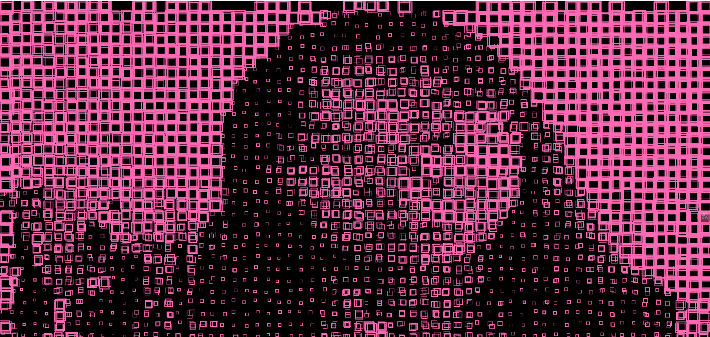
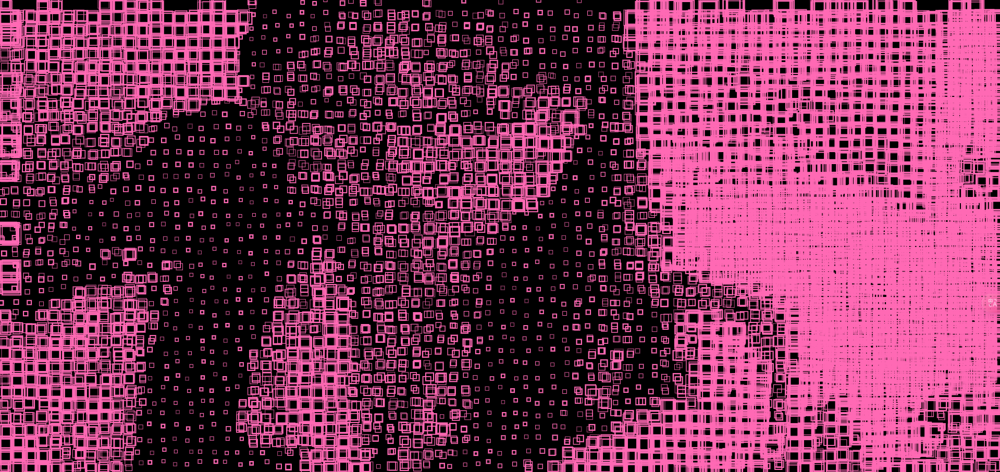

# HW09
## HW09A
**Creating a slider to control the color**
```
  slider = createSlider(0, 255);
  slider.position((height * 5) / 4, height / 2);
  slider.size(320);
  ```


**After that,I want to add transparency and image behind**


- Import image


Yayoi Kusama (b. 1929), 'Pumpkin,' 2013.

- Write code to add transparecy 


` oImg.pixels[idx + 3] = 255 - s;`

## HW09B
My project HW03B would like to achieve an effect like this:


**Pixel Block Rendering**: The video feed is processed in chunks, creating a stylized "pixel block" effect.


**Distortion with Random Offsets**: Each rectangle is slightly shifted to create a glitchy, distorted look.


**Brightness-Based Scaling**: Brighter areas in the video show larger rectangles, while darker areas show smaller ones.


**Variable Stroke Weight and Overlap**: Randomized stroke weight and multiple overlapping rectangles in darker areas.




After I modified the spacing between each pixel block(from 1.5 to 1.2):


`let spacing = blockSize * 1.2;`


