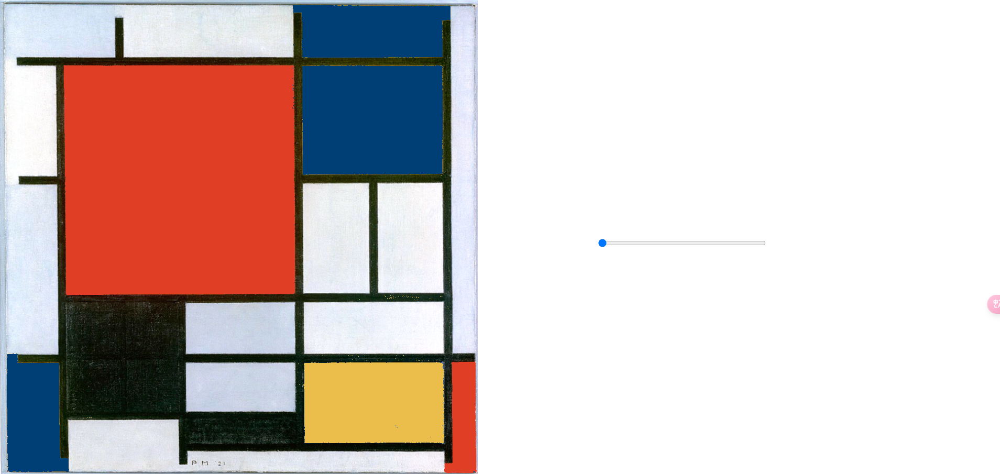
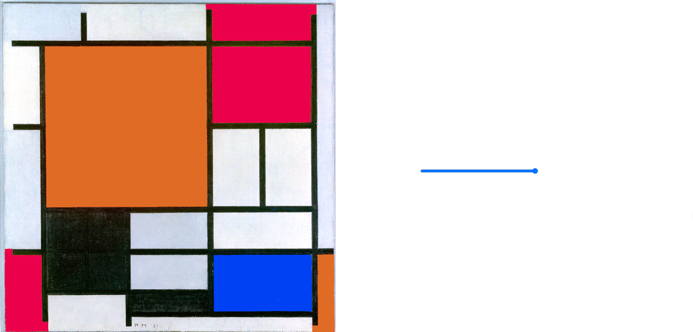

# HW09
## HW09A
**creating a slider to control the color**
```
  slider = createSlider(0, 255);
  slider.position((height * 5) / 4, height / 2);
  slider.size(320);
  ```





**After that,I want to add transparency and image behind**
Import image


Yayoi Kusama (b. 1929), 'Pumpkin,' 2013.

write code to add transparecy 
` oImg.pixels[idx + 3] = 255 - s;`
## HW09B
